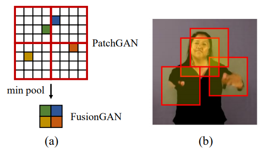
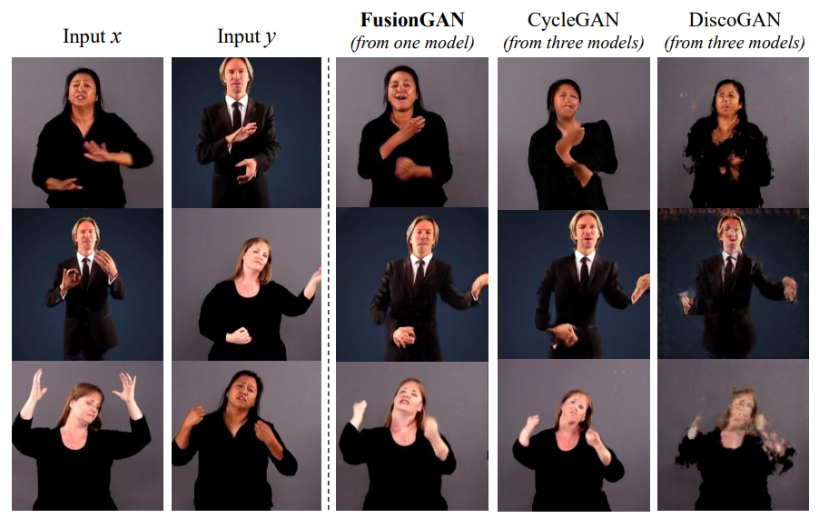

# FusionGAN-Tensorflow
Simple Tensorflow implementation of [FusionGAN](https://arxiv.org/pdf/1804.07455.pdf) (CVPR 2018)

## Requirements
* Tensorflow 1.8
* Python 3.6

## Usage
```
├── dataset
   └── YOUR_DATASET_NAME
       ├── trainA
           ├── xxx.jpg (name, format doesn't matter)
           ├── yyy.png
           └── ...
       ├── trainB
           ├── zzz.jpg
           ├── www.png
           └── ...
       ├── testA
           ├── aaa.jpg 
           ├── bbb.png
           └── ...
       └── testB
           ├── ccc.jpg 
           ├── ddd.png
           └── ...
```

### 3. Train
* python main.py --phase train --dataset pose --epoch 20

### 4. Test
* python main.py --phase test --dataset pose --epoch 20

## Summary
 

## Architecture


## Min-Pooling


## Shape loss


## Results
### Our results
<div align="">
   
</div>

### Paper results



## Author
Junho Kim
